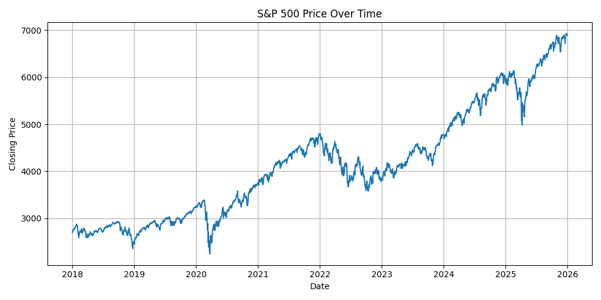
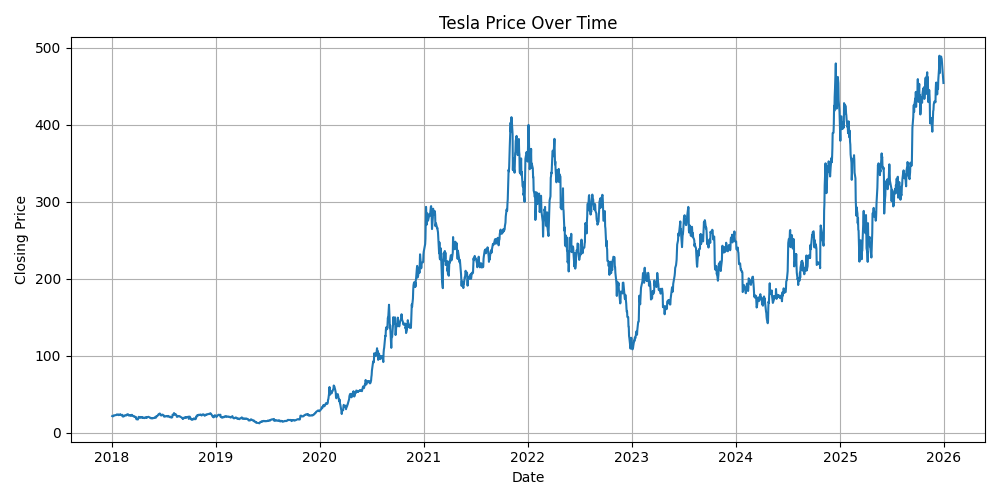
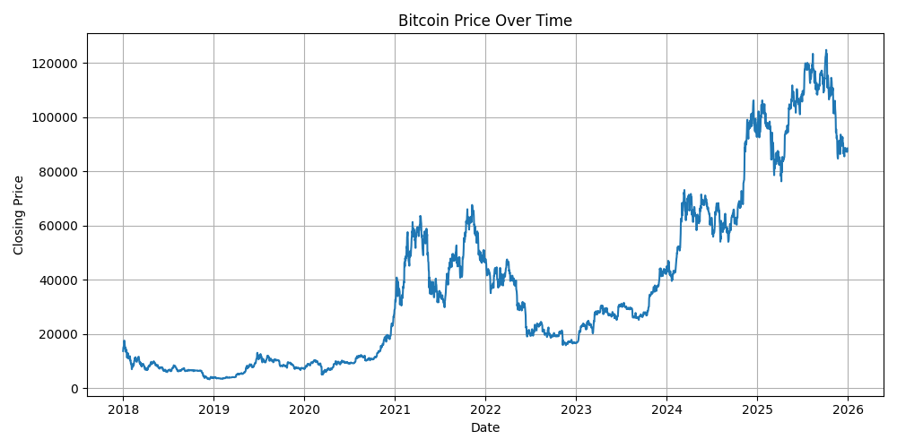
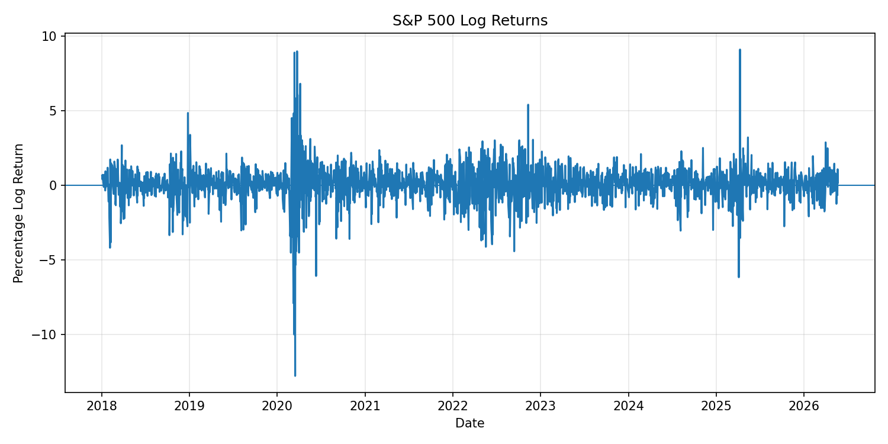
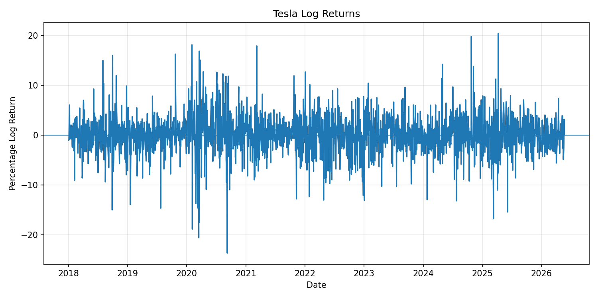
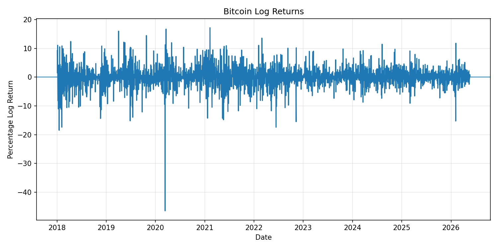
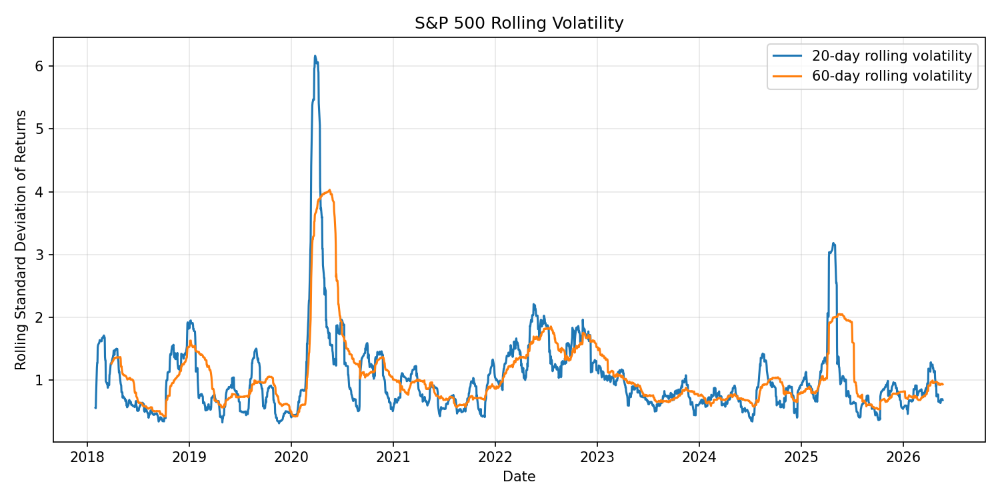
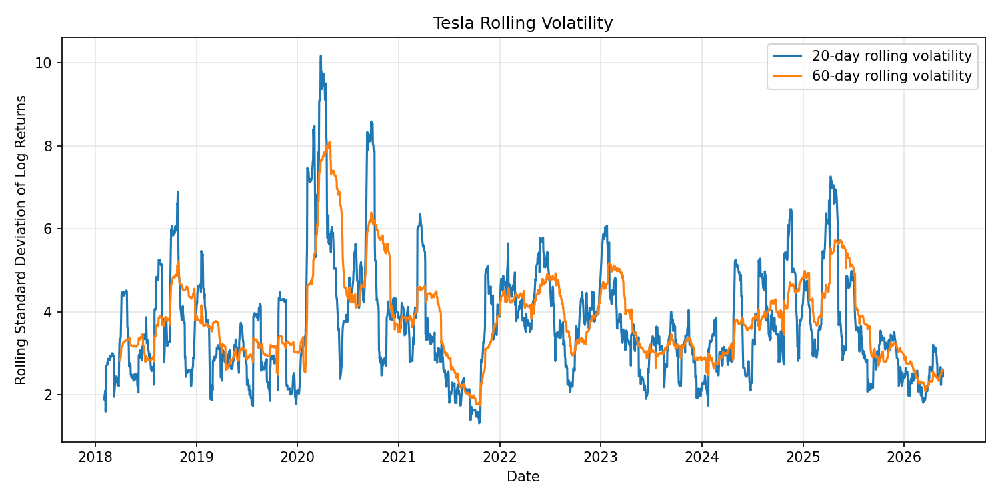
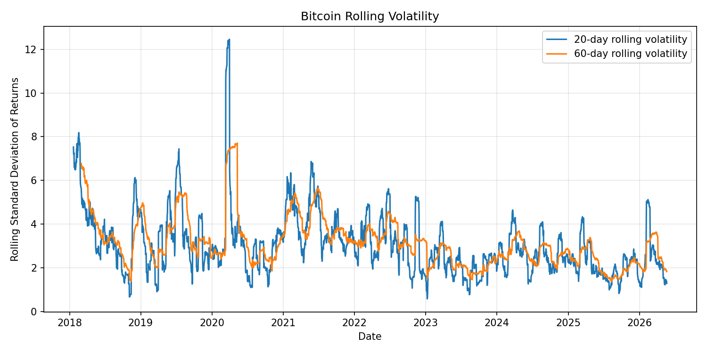
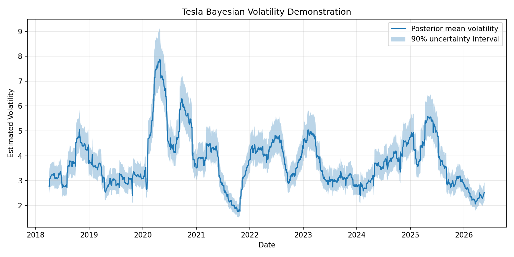

# Bayesian Financial Volatility Analysis

## Introduction

This repository provides a concise demonstration of financial time series techniques used to understand how market risk changes over time.

Instead of trying to predict stock prices directly, this demonstration focuses on volatility, uncertainty, and risk dynamics. In financial data, periods of calm and periods of stress often appear in clusters. This makes time series techniques especially useful for understanding when markets become more uncertain and how that uncertainty evolves.

## Motivation

Financial markets do not move with constant risk. Some periods are relatively stable, while others experience large and persistent fluctuations.

One important pattern in financial time series is **volatility clustering**. This means that large market movements are often followed by more large movements, while calm periods tend to remain calm.

This idea is useful in:

- financial risk monitoring
- portfolio management
- actuarial and insurance risk analysis
- derivative pricing
- stress testing
- quantitative finance

## Main Question

This demonstration focuses on the question:

> How does market risk change over time?

More specifically, it explores:

- When does the market become more volatile?
- Do periods of market stress persist?
- How can changing uncertainty be measured dynamically?
- Why are constant-variance assumptions often unrealistic in financial data?

## Data

This demonstration uses historical financial market data for three assets:

- S&P 500
- Tesla
- Bitcoin

These assets were selected because they represent different types of financial behavior. The S&P 500 represents broad market movement, Tesla represents an individual high-growth stock, and Bitcoin represents a cryptocurrency with large price swings.

## Asset Price Overview

Before applying financial time series techniques, the first step is to visualize the raw price movement of each asset.

The three assets selected here represent different types of financial behavior:

- S&P 500: broad market index
- Tesla: individual high-growth stock
- Bitcoin: cryptocurrency with large price swings

### S&P 500 Price Over Time



The S&P 500 shows the overall movement of the broader U.S. equity market. Compared with Tesla and Bitcoin, its price path is generally smoother because it represents a diversified market index rather than a single asset. This makes it a useful benchmark for observing general market trends before moving into return and volatility analysis.

### Tesla Price Over Time



Tesla shows stronger price fluctuations than the S&P 500, reflecting the behavior of an individual growth stock. Its price movement is influenced not only by broad market conditions, but also by company-specific news, investor sentiment, and expectations about future growth. This makes Tesla useful for demonstrating higher individual-stock volatility.

### Bitcoin Price Over Time



Bitcoin displays large and rapid price changes compared with traditional equity assets. Its price behavior is useful for demonstrating highly volatile financial time series, where market uncertainty can change quickly over time. This makes Bitcoin a strong example for studying volatility clustering and risk dynamics.

## Methodology

### 1. Convert Prices to Log Returns

Instead of analyzing raw prices directly, financial time series models usually work with returns.

The log return is defined as:

```math
y_t = 100 * \log\left(\frac{S_t}{S_{t-1}}\right)
```

where:
- S_t is the asset price at time t 
- y_t is the percentage log return

Log returns make price movements easier to compare across time.


### 2. Visualize Return Behavior

After computing log returns, the return series is plotted over time.

Typical patterns include:

- returns fluctuating around zero
- occasional extreme movements
- periods where large movements appear close together

These patterns suggest that financial volatility is not constant.

#### Return Plots

##### S&P 500 Log Returns



The S&P 500 returns mostly fluctuate around zero, but there are clear periods with large positive and negative movements. The largest return shocks appear around 2020, with another noticeable volatile period around 2025. This suggests that broad market risk is not constant over time.

##### Tesla Log Returns



Tesla shows much larger return swings than the S&P 500. The return plot contains frequent sharp positive and negative movements, especially around 2020, 2022, and 2025. This reflects the higher volatility usually associated with an individual growth stock.

##### Bitcoin Log Returns



Bitcoin also shows large return movements, including several extreme positive and negative shocks. The return behavior is highly volatile, which makes Bitcoin useful for demonstrating why financial time series methods often focus on risk and uncertainty rather than only price direction.

### 3. Identify Volatility Clustering

Volatility clustering means that high-volatility periods tend to be followed by more high-volatility periods.

This is important because it shows that financial risk can persist over time instead of appearing randomly and independently.

### 4. Compute Rolling Volatility

Rolling volatility is computed using rolling standard deviation windows, such as:

- 20 trading days
- 60 trading days

This provides a simple time-varying measure of market uncertainty.

Rolling volatility often increases during:

- financial crises
- economic shocks
- geopolitical uncertainty
- major market corrections


#### Rolling Volatility Plots

##### S&P 500 Rolling Volatility



The S&P 500 rolling volatility rises sharply around 2020, showing a major period of market stress. Smaller increases also appear around 2022 and 2025. The 20-day rolling volatility reacts faster to sudden shocks, while the 60-day rolling volatility is smoother and captures more persistent risk.

##### Tesla Rolling Volatility



Tesla has a higher and more unstable volatility pattern than the S&P 500. The rolling volatility reaches very high levels around 2020 and rises again around 2025. This supports the idea of volatility clustering, where high-risk periods tend to persist rather than appear randomly.

##### Bitcoin Rolling Volatility



Bitcoin rolling volatility is consistently high and contains several sharp spikes. The volatility peak around 2020 is especially large. Compared with the S&P 500, Bitcoin shows stronger instability, which makes it a useful example of highly volatile financial behavior.

### 5. Interpret Hidden Volatility Dynamics

In financial time series analysis, volatility can be viewed as a hidden process.

The returns are observed, but the true level of market uncertainty is not directly observed. This motivates stochastic volatility models and Bayesian approaches.

### Bayesian Volatility Demonstration



The Bayesian volatility demonstration estimates Tesla's hidden volatility over time. The line represents the posterior mean volatility, while the shaded area represents a 90% uncertainty interval.

The estimated volatility rises sharply around 2020 and increases again around 2025, which is consistent with the rolling volatility plot. The uncertainty interval also becomes wider during high-volatility periods, showing that uncertainty around the volatility estimate increases when the market is more unstable.

This demonstrates the Bayesian idea that volatility is not only changing over time, but also estimated with uncertainty.

## Bayesian Perspective

Bayesian methods allow uncertainty to be modeled probabilistically.

Instead of producing only one fixed volatility estimate, Bayesian inference can provide:

- posterior distributions
- uncertainty intervals
- latent volatility estimates

This is useful because financial markets are uncertain and constantly evolving.

## Why This Matters

These techniques are useful because financial risk is not constant.

They help answer practical questions such as:

- Is the market currently calm or stressed?
- Are large price movements becoming more frequent?
- How should short-term risk be monitored?
- When might simple constant-risk models underestimate uncertainty?

Rather than focusing only on price prediction, financial time series analysis helps us understand the structure and evolution of market risk.

## Techniques Demonstrated

This repository gives a basic demonstration of several financial time series ideas:

| Technique | Purpose | Practical Use |
|---|---|---|
| Log Returns | Convert prices into comparable financial movements | Return analysis and risk modeling |
| Rolling Volatility | Measure how risk changes over time | Market risk monitoring |
| Volatility Clustering | Observe whether high-risk periods persist | Stress detection and portfolio risk |
| Hidden Volatility | Treat market uncertainty as an unobserved process | Stochastic volatility modeling |
| Bayesian Perspective | Quantify uncertainty around estimates | Probabilistic risk analysis |

## Results and Key Observations

The return plots show that all three assets have returns centered around zero, but the size and frequency of extreme movements are very different. The S&P 500 is relatively smoother, while Tesla and Bitcoin show much larger return shocks.

The rolling volatility plots show that financial risk changes over time. Volatility rises during stressed periods and then gradually declines during calmer periods. This supports the idea that financial volatility is not constant.

The 20-day rolling volatility reacts more quickly to sudden market movements, while the 60-day rolling volatility provides a smoother view of longer-term risk conditions.

Tesla and Bitcoin show stronger volatility clustering than the S&P 500. This means high-volatility periods are more persistent and easier to observe in these assets.

The Bayesian volatility demonstration provides an additional perspective by estimating hidden volatility with an uncertainty interval. This shows that financial risk is not directly observed, and statistical methods can help estimate both the level of risk and the uncertainty around that estimate.

Overall, these plots show that financial time series techniques are useful for understanding market risk, volatility persistence, and uncertainty dynamics. The goal is not to perfectly predict future prices, but to better understand how financial risk evolves through time.

## Repository Structure

```text
bayesian-financial-volatility/
│
├── README.md
├── requirements.txt
├── .gitignore
│
├── data/
│
├── scripts/
│   ├── download_data.py
│   ├── returns_analysis.py
│   ├── rolling_volatility.py
│   └── bayesian_sv_model.py
│
├── plots/
│   ├── sp500_price_over_time.png
│   ├── tesla_price_over_time.png
│   ├── bitcoin_price_over_time.png
│   ├── sp500_log_returns.png
│   ├── tesla_log_returns.png
│   ├── bitcoin_log_returns.png
│   ├── sp500_rolling_volatility.png
│   ├── tesla_rolling_volatility.png
│   ├── bitcoin_rolling_volatility.png
│   └── bayesian_volatility_tesla.png
```

## Possible Extensions

Future extensions could include:

- stochastic volatility modeling
- Bayesian MCMC estimation
- Hidden Markov Models
- regime-switching models
- particle filtering
- probabilistic forecasting

## Tools

Possible tools for implementation:

- Python
- pandas
- numpy
- matplotlib
- yfinance
- PyMC
- ArviZ

## Disclaimer

This repository is for educational and demonstration purposes only. It is not financial advice or an investment recommendation.
